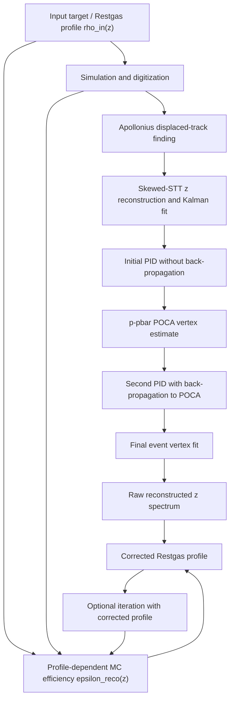

# RestgasDetermination

A PandaRoot-based research branch for reconstructing and correcting the longitudinal residual-gas (“Restgas”) interaction profile in the PANDA target region.

This repository is based on the PandaRoot `oct19` tag. The Restgas-specific development starts after commit `ef9a564`. The principal analysis code is located in [`macro/target`](macro/target). This document describes the current `oct19` workflow, including the event-by-event POCA hand-off, configurable beam momentum and Restgas profile, and profile-dependent efficiency correction.

> **Scope and maturity**
>
> The current repository is a **Monte Carlo research implementation used for the studies in Chapters 7 and 8 of the associated thesis**. It contains the main ingredients of the Restgas-determination method, including distributed target generation, displaced-track reconstruction, POCA-based back-propagation, vertex reconstruction, and profile-dependent efficiency correction.
>
> The analysis and correction macros are designed primarily for Monte Carlo closure, efficiency, and systematic studies corresponding to the thesis workflow.


### Repository state covered by this README

The current workflow includes:

- distributed target generation with selectable cryopump or no-cryopump profiles;
- displaced-track reconstruction using the Apollonius triplet finder;
- an event-level `event_poca` data product keyed by `event_id`;
- second-pass GEANE propagation to the matching event POCA;
- beam-momentum propagation from JSON configuration into both analysis macros;
- consistent `*_pid_final.root` and `*_ana_final.root` completion sentinels;
- profile-dependent efficiency correction and robustness studies.

---

## 1. Physics goal

PANDA determines luminosity from a reference reaction with a known cross section, primarily elastic antiproton-proton scattering. In the fixed-target geometry, hydrogen from the cluster-jet target and residual gas in the beam pipe form an interaction region that is extended along the beam axis.

The measured vertex spectrum is therefore not simply the physical gas-density profile. It is modified by:

- detector acceptance;
- tracking and PID efficiency;
- displaced-vertex reconstruction efficiency;
- position-dependent resolution and migration between longitudinal bins;
- event-selection cuts.

The purpose of this repository is to reconstruct the interaction vertex for off-IP events and recover the underlying Restgas profile through a profile-dependent efficiency correction.

The final quantity of interest is the longitudinal interaction-density shape

```math
\rho_{\mathrm{gas}}(z),
```

or, in binned form, the generated number of interactions $N_{\mathrm{true},i}$ in each longitudinal bin.

---

## 2. Method overview

The complete physics method consists of five stages:

1. **Generate or read an extended target profile.**
2. **Reconstruct tracks without imposing the nominal interaction point.**
3. **Estimate the interaction vertex from the track-pair POCA.**
4. **Back-propagate tracks to that vertex and perform the final vertex fit.**
5. **Correct the reconstructed $z$ distribution with a profile-dependent efficiency map.**



The thesis-level target workflow is **event-by-event**:

```text
raw hits
  -> Apollonius track candidates
  -> Kalman-fitted tracks
  -> PID without back-propagation
  -> event POCA
  -> reuse the original Kalman tracks
  -> PID with back-propagation to the event POCA
  -> final vertex fit
  -> reconstructed Restgas profile
```

The repository implements this event-by-event chain for both fixed-vertex and continuously distributed Restgas samples. It also provides an MC-truth control mode for closure studies.

---

## 3. Theoretical and numerical implementation

### 3.1 Distributed beam-target vertex generation

The longitudinal density is supplied as a two-column ASCII file:

```text
# position [cm]    density or bin weight [10^12 atoms/cm^2]
-570.1             ...
-570.0             ...
...
1100.0             ...
```

The current implementation is based on:

- `pgenerators/Target/PndTargetGenerator.h`
- `pgenerators/Target/PndTargetGenerator.cxx`
- `tools/MasterTasks/PndMasterRunSim.cxx`
- `macro/target/prod_sim_hvmaps.C`

`PndTargetGenerator` reads the density points into a `TGraph`, constructs an inverted cumulative distribution, and samples the longitudinal interaction position from it. The transverse beam position is sampled with a radial Gaussian width and is restricted by the beam-pipe radius.

Schematically,

```math
z \sim \rho_{\mathrm{in}}(z),
\qquad
r_\perp \sim \mathcal{G}(0,\sigma_r(z)),
```

with the current Restgas target mode using a nominal beam radius of

```math
\sigma_r = 0.1\ \mathrm{cm}.
```

Outside the constant-width beam region, the code can increase the transverse width according to a configurable beam-divergence slope.

#### Current target modes

`prod_sim_hvmaps.C` maps

```cpp
use_restgas == true
```

to

```cpp
PndMasterRunSim::SetTargetMode(8);
```

Target mode 8 loads the profile selected by the `restgas_profile` configuration field. A basename is resolved below `$VMCWORKDIR/input`; an absolute path may also be supplied. The default is:

```text
$VMCWORKDIR/input/restgas_16012024_with_cryopump.txt
```

The transverse beam-radius parameter is `0.1 cm`.

The current repository contains two principal profile files:

| File | Intended use |
|---|---|
| `input/restgas_16012024_with_cryopump.txt` | Default profile; includes the cryopump contribution |
| `input/restgas_16012024_no_cryopump.txt` | Alternative profile for studies without the cryopump contribution |

Both files use the longitudinal coordinate in **cm** and tabulate the density in units indicated by the file header as $10^{12}$ atoms/cm$^2$. The covered beam-line interval is approximately $-570$ to $+1100$ cm.

Select the alternative profile directly in JSON:

```json
{
  "use_restgas": "true",
  "restgas_profile": "restgas_16012024_no_cryopump.txt"
}
```

Changing profiles does not require a source edit or rebuild. The simulation macro validates that the selected file exists before starting.

#### Profile-file constraints

The current cumulative implementation performs

```cpp
ysum += density;
```

without multiplying by the local bin width. Consequently:

- use **uniformly spaced $z$ points**, or
- store an already bin-width-weighted value in the second column.

The active `PndTargetGenerator` labels its longitudinal coordinate in **cm**. An older `README_RestGas` mentions mm; for this branch, use cm and verify the profile range before large production.

---

### 3.2 Displaced-track reconstruction

Standard primary-track finders often assume that tracks originate close to the nominal beam axis. This is inappropriate for Restgas interactions distributed over a long region.

The dedicated reconstruction chain is configured in:

- `macro/target/reco_complete.C`

Its relevant stages are:

1. `PndTrkTracking2` performs the standard reconstruction.
2. `PndUnassignedHitsTask` collects hits not assigned by the standard track finder.
3. `PndApolloniusTripletTrackFinderTask` reconstructs displaced trajectories using STT drift-circle triplets and MVD/GEM information.
4. `PndSttSkewStrawPzFinderTask` recovers the longitudinal track component from skewed STT layers.
5. `PndRecoKalmanTask2` fits the resulting tracks with `SetPropagateToIP(kFALSE)`.

#### Apollonius track finding

Three STT drift measurements define three circles in the transverse plane. The classical Apollonius problem asks for circles tangent to all three. Up to eight geometric solutions can exist because of the internal/external tangency combinations.

The track finder reduces combinatorics by:

- choosing spatially separated inner, middle, and outer hit rows;
- requiring neighbor/topological compatibility;
- imposing azimuthal compatibility;
- growing each candidate with additional compatible hits;
- selecting the populated trajectory that best matches the complete hit pattern.

This avoids a hard nominal-IP constraint and preserves efficiency for displaced vertices.

---

### 3.3 First PID pass and POCA determination

The first PID pass is implemented by:

- `macro/target/pid_complete.C`

It configures `PndPidCorrelator` with:

```cpp
SetBackPropagate(kFALSE);
```

so the initial candidate construction uses the first fitted track parameters and does not force the track back to the origin.

The initial proton and antiproton candidates are then analyzed by:

- `macro/target/ana_dpm.C`

`ana_dpm.C` combines the proton and antiproton candidates and evaluates their geometric point of closest approach using:

```cpp
RhoVtxPoca::GetPocaVtx(...)
```

The resulting coordinates and distance of closest approach are stored as:

```text
proton_pbar_vtx_x
proton_pbar_vtx_y
proton_pbar_vtx_z
proton_pbar_doca
```

For the two-pass workflow, `ana_dpm.C` writes two complementary products:

- `<prefix>_boost.root`, containing an `event_poca` tree with exactly one entry per input event;
- `<prefix>_vtx_fit.json`, containing fitted sample-level means and widths for diagnostics and legacy fixed-IP compatibility.

The event-level tree stores:

```text
event_id
x
y
z
valid
```

The `valid` flag is set only when the event contains at least one proton and one antiproton candidate and the POCA result is finite.

---

### 3.4 POCA-first back-propagation

The second PID pass is started through:

- `macro/target/prod_aod_complete.C`
- `tools/MasterTasks/PndMasterMultiPidTask.cxx`
- `pid/PidCorr/PndPidTrackInfo.cxx`

The Python runner passes the first-pass ROOT file to the second PID pass through:

```text
POCA_VERTEX_FILE=<prefix>_boost.root
```

The fitted means are still exported through `FIT_VERTEX_X/Y/Z` as a backwards-compatible fallback for legacy fixed-IP inputs. It then calls:

```cpp
prod_aod_complete.C(prefix, "fitvertex", use_mvd_hvmaps)
```

The `"fitvertex"` option activates:

```cpp
correlator->SetUseFittedVertex(kTRUE);
```

`PndPidCorrelator` opens the `event_poca` tree and loads entry `event_id` before constructing candidates. `PndPidTrackInfo.cxx` uses that event's `x,y,z` as the GEANE target and performs point propagation:

```cpp
fGeanePropagator->SetPoint(targetPoint);
fGeanePropagator->PropagateToPCA(1, -1);
```

This is the essential POCA-first operation. Track momentum, position, covariance, path length, and subsequent PID inputs are evaluated at the estimated physical interaction point instead of the nominal beam axis. A missing, mismatched, or invalid event POCA causes the affected track to be rejected explicitly rather than propagated to a job-wide mean or to the origin.

The MC control mode uses:

```cpp
prod_aod_complete.C(prefix, "mcvertex", use_mvd_hvmaps)
```

which obtains the target point from each track's MC start vertex.

---

### 3.5 Final event vertex reconstruction

The final analysis is implemented in:

- `macro/target/ana_complete.C`

Both `ana_dpm.C` and `ana_complete.C` receive the configured antiproton beam momentum through `mom`. They construct the initial-state four-vector dynamically as

```math
p_{\mathrm{initial}}
=
\left(0,0,p_{\bar p},
\sqrt{p_{\bar p}^{2}+m_{p}^{2}}+m_{p}\right),
```

so changing the beam momentum does not require editing either macro.

It reads the second-pass `pid_final` output, builds proton-antiproton candidates, performs the final event-level vertex fit, and stores the reconstructed and MC quantities in:

```text
<prefix>_ana_final.root
```

Important branches used by the correction macros include:

```text
pvx, pvy, pvz
pvx_mc, pvy_mc, pvz_mc
```

For fixed-position efficiency scans, the macro also appends:

```text
config_x config_y config_z reconstructed_entries
```

to:

```text
vtx_stats.txt
```

This file can be used to construct a longitudinal efficiency scan.

---

### 3.6 Profile-dependent efficiency correction

The raw reconstructed spectrum is related to the true profile through acceptance, selection efficiency, and resolution migration.

A simple “truth-coordinate” efficiency is

```math
\varepsilon_{\mathrm{truth},i}
=
\frac{N_{\mathrm{MC,rec}}(z_{\mathrm{true}}\in i)}
     {N_{\mathrm{MC,gen}}(z_{\mathrm{true}}\in i)}.
```

For Restgas determination, the more useful profile-dependent reconstructed-coordinate efficiency is

```math
\varepsilon_{\mathrm{reco},i}
=
\frac{N_{\mathrm{MC,rec}}(z_{\mathrm{reco}}\in i)}
     {N_{\mathrm{MC,gen}}(z_{\mathrm{true}}\in i)}.
```

Because its numerator is filled in reconstructed coordinates, this map includes both geometrical efficiency and migration caused by finite vertex resolution. The corrected profile is then estimated bin-by-bin as

```math
N_{\mathrm{corr},i}
=
\frac{N_{\mathrm{data,rec},i}}
     {\varepsilon_{\mathrm{reco},i}}.
```

This is a forward-model correction rather than an explicit deconvolution. If the MC input profile resembles the physical profile sufficiently well, the migration present in the measured numerator is compensated by the migration encoded in the efficiency map.

The main correction code is located in:

- `macro/target/correction/efficiency_correction.C`
- `macro/target/correction/efficiency_correction_1.C`
- `macro/target/correction/efficiency_correction_2.C`
- `macro/target/correction/efficiency_correction_steps.C`
- `macro/target/correction/run_efficiency_batch.py`

Recommended interpretation:

| File | Role |
|---|---|
| `efficiency_correction.C` | Central-region diagnostic, default range $[-30,+30]$ cm |
| `efficiency_correction_1.C` | Earlier wide-range version |
| `efficiency_correction_2.C` | Current wide-range analysis used by `run_efficiency_batch.py`; supports file-index ranges and non-uniform binning |
| `efficiency_correction_steps.C` | Method/debug study with explicit intermediate steps |
| `run_efficiency_batch.py` | Runs the true-profile versus input-profile robustness matrix |

`efficiency_correction_2.C` calculates both `hEff` and `hEffReco`. The histogram

```text
hCorrected_RecoEff
```

is the direct implementation of the profile-dependent reconstructed-coordinate correction above.

The macro also contains a **hybrid analysis variant**:

- in the current `efficiency_correction_2.C`, use truth-coordinate efficiency for $-2 \le z \le 2$ cm;
- use reconstructed-coordinate efficiency outside this central interval.

Earlier correction variants use slightly different central boundaries, so the numerical cut should be checked in the selected macro before comparing results. This hybrid definition is an analysis choice and should not be confused with the general correction formula.

The correction macros use English comments and plotting annotations; these presentation changes do not alter the numerical correction logic.

---

### 3.7 Iterative removal of input-profile dependence

The efficiency depends weakly on the profile used in the MC because resolution migration is profile dependent. This appears to create a circular problem: the profile is needed to calculate the efficiency used to measure the profile.

The intended solution is iterative:

1. Start from the nominal Target Group profile $\rho_0(z)$.
2. Generate MC and calculate $\varepsilon_{\mathrm{reco},0}(z)$.
3. Correct the measured spectrum to obtain $\rho_1(z)$.
4. Use $\rho_1(z)$ as the next MC input.
5. Repeat until the profile or integrated correction changes negligibly.

The thesis robustness study tests mismatches between the “true” pseudo-data profile and the profile used for the efficiency MC. The method substantially reduces the initial model bias, especially in the central high-statistics region.

---

## 4. Theory-to-code map

| Physics operation | Main code |
|---|---|
| Select elastic $\bar pp$ generation | `macro/target/prod_sim_hvmaps.C`, generator `DPM2` |
| Load the longitudinal target/Restgas profile | `tools/MasterTasks/PndMasterRunSim.cxx` |
| Sample the 3D interaction vertex | `pgenerators/Target/PndTargetGenerator.{h,cxx}` |
| Select standard or HV-MAPS MVD geometry | `prod_sim_hvmaps.C`, `all.par` / `all_hvmaps.par` |
| Digitization | `macro/target/prod_aod_hvmaps.C` |
| Collect unassigned hits | `PndUnassignedHitsTask` in `reco_complete.C` |
| Displaced-track pattern recognition | `PndApolloniusTripletTrackFinderTask` |
| Recover longitudinal track information | `PndSttSkewStrawPzFinderTask` |
| Kalman fit without nominal-IP propagation | `PndRecoKalmanTask2` in `reco_complete.C` |
| Initial PID without back-propagation | `pid_complete.C` |
| Proton-antiproton POCA | `ana_dpm.C`, `RhoVtxPoca` |
| Transfer event POCA to second pass | `runall_prod_hvmaps.py`, `POCA_VERTEX_FILE`, `event_poca` |
| Activate fitted-vertex or MC-vertex mode | `PndMasterMultiPidTask.cxx` |
| GEANE propagation to a 3D point | `PndPidTrackInfo.cxx` |
| Final event vertex fit and output tree | `ana_complete.C` |
| Efficiency and profile correction | `macro/target/correction/efficiency_correction_2.C` |
| Robustness matrix | `macro/target/correction/run_efficiency_batch.py` |

---

## 5. Build and environment

### 5.1 Prerequisites

For the required software environment and prerequisites, refer to the official [PandaRoot installation documentation](https://webdocs.gsi.de/~pandacc/documentation/2023-08-25-dev/sphinx/Installation/Install_PandaRoot.html).

### 5.2 Build

For PandaRoot installation, compilation, and environment setup instructions, refer to the official [PandaRoot installation documentation](https://webdocs.gsi.de/~pandacc/documentation/2023-08-25-dev/sphinx/Installation/Install_PandaRoot.html).

### 5.3 Verify or select the Restgas profile

The repository already contains the default profile required by target mode 8:

```text
/path/to/RestgasDetermination/input/restgas_16012024_with_cryopump.txt
```

Verify that it is present after cloning:

```bash
test -f input/restgas_16012024_with_cryopump.txt
```

The alternative profile is:

```text
input/restgas_16012024_no_cryopump.txt
```

Select a profile with the JSON field:

```json
"restgas_profile": "restgas_16012024_no_cryopump.txt"
```

Basenames are read from `$VMCWORKDIR/input`. Absolute paths are accepted for site-specific or generated profiles.

---

## 6. Recommended usage

Run the workflow from:

```bash
cd /path/to/RestgasDetermination/macro/target
```

### 6.1 Configuration reference

The main runner combines built-in defaults, a JSON file, and command-line overrides in that order. The principal fields are:

| Field | Type | Default | Purpose |
|---|---:|---|---|
| `prefix` | string | `"test"` | Dataset name and output subdirectory |
| `nevts` | integer | `1000` | Events generated by each job |
| `dec` | string | `"pp_dd"` | DPM/FTF/BOX mode or EvtGen input |
| `mom` | number | `4.06` | Antiproton beam momentum in GeV/c |
| `use_mvd_hvmaps` | string | `"false"` | Select `all_hvmaps.par` when `"true"` |
| `ipx`, `ipy`, `ipz` | number | `0.0` | Fixed interaction point in cm |
| `use_restgas` | string | `"false"` | Enable distributed `TargetMode=8` |
| `restgas_profile` | string | `"restgas_16012024_with_cryopump.txt"` | Profile basename below `input/`, or an absolute path |
| `theta_min`, `theta_max` | number | `0.0`, `180.0` | Generator polar-angle range in degrees |
| `back_prop_vertex` | string | `"poca"` | Select event POCA or MC-truth propagation |
| `output_path` | string | `"data"` | Base output directory |

### 6.2 Fixed-vertex POCA validation

This validates the complete two-pass POCA chain at a known interaction point.

Create a configuration:

```json
{
  "prefix": "point_poca_4p06_z0",
  "nevts": 10000,
  "dec": "DPM2",
  "mom": 4.06,
  "use_mvd_hvmaps": "true",
  "ipx": 0.0,
  "ipy": 0.0,
  "ipz": 0.0,
  "use_restgas": "false",
  "restgas_profile": "restgas_16012024_with_cryopump.txt",
  "theta_min": 22.0,
  "theta_max": 150.0,
  "back_prop_vertex": "poca",
  "output_path": "/absolute/path/to/data"
}
```

Run:

```bash
python3 runall_prod_hvmaps.py point_poca_4p06_z0.json
```

The executed chain is:

```text
prod_sim_hvmaps.C
  -> prod_aod_hvmaps.C
  -> reco_complete.C
  -> pid_complete.C
  -> ana_dpm.C
  -> prod_aod_complete.C(..., "fitvertex", ...)
  -> ana_complete.C
```

### 6.3 Generate a fixed-IP scan

```bash
python3 generate_configs.py \
  --type point \
  --vertex poca \
  --moms 4.06 \
  --ipxs 0.0 \
  --ipys 0.0 \
  --ipzs -10.0 -7.5 -5.0 -2.5 0.0 2.5 5.0 7.5 10.0 \
  --nevts 10000 \
  --use_mvd_hvmaps true \
  --output-path /absolute/path/to/data \
  --output-dir configs/efficiency_scan
```

Run several configurations locally:

```bash
python3 runall_prod_hvmaps.py configs/efficiency_scan -j 4
```

The `-j` option parallelizes **different configuration files**. It does not split the events in one configuration.

### 6.4 SLURM array production

A minimal site-independent template is:

```bash
#!/bin/bash
#SBATCH --job-name=restgas
#SBATCH --array=0-99
#SBATCH --time=08:00:00
#SBATCH --cpus-per-task=1
#SBATCH --mem=4G
#SBATCH --output=/absolute/path/to/log/%A_%a.out
#SBATCH --error=/absolute/path/to/log/%A_%a.err

cd /path/to/RestgasDetermination
source build/config.sh -p

cd macro/target
python3 runall_prod_hvmaps.py /absolute/path/to/config.json
```

Each array task receives a distinct file prefix from `SLURM_ARRAY_TASK_ID`.

### 6.5 MC-truth control for a distributed Restgas profile

For a closure test with a fully distributed profile:

```json
{
  "prefix": "restgas_mc_control",
  "nevts": 10000,
  "dec": "DPM2",
  "mom": 4.06,
  "use_mvd_hvmaps": "true",
  "ipx": 0.0,
  "ipy": 0.0,
  "ipz": 0.0,
  "use_restgas": "true",
  "restgas_profile": "restgas_16012024_with_cryopump.txt",
  "theta_min": 22.0,
  "theta_max": 150.0,
  "back_prop_vertex": "mc",
  "output_path": "/absolute/path/to/data"
}
```

Run:

```bash
python3 runall_prod_hvmaps.py restgas_mc_control.json
```

This uses the per-track MC start vertex for back-propagation and is therefore suitable for validating the ideal reconstruction and efficiency-correction chain.

> Do not interpret `back_prop_vertex: "mc"` as an experimental-data workflow. It is a closure/reference mode only.

### 6.6 Profile-dependent efficiency correction

Example using indexed file ranges:

```bash
cd macro/target/correction

root -b -q -l \
'efficiency_correction_2.C(
  "../data/pseudo_data/reco/pseudo_data_%d_ana_final.root,1,100",
  "../data/efficiency_mc/reco/efficiency_mc_%d_ana_final.root,1,500",
  "../data/efficiency_mc/reco/efficiency_mc_%d_sim.root,1,500",
  "../data/pseudo_data/reco/pseudo_data_%d_sim.root,1,100",
  "pseudo_data_corrected"
)'
```

Main outputs:

```text
pseudo_data_corrected.png
pseudo_data_corrected_eff.png
pseudo_data_corrected.root
```

Relevant ROOT histograms:

```text
hDataRaw
hMCGen
hMCRec
hMCRecReco
hEff
hEffReco
hCorrected_NoBias
hCorrected_RecoEff
```

For pseudo-data closure tests, the optional fourth input supplies the generated truth profile.

### 6.7 Robustness matrix

Edit the dataset tags and file ranges in:

```text
macro/target/correction/run_efficiency_batch.py
```

then run:

```bash
python3 run_efficiency_batch.py
```

The script evaluates combinations such as nominal, `+5%`, `-5%`, `+10%`, `-10%`, `+20%`, and `-20%` Restgas profiles, reproducing the Chapter 8 input-versus-truth stress tests.

---

## 7. Output structure

The main Python runner creates:

```text
<output_path>/
└── <prefix>/
    ├── config.json
    ├── log/
    │   ├── <job>_sim.log
    │   ├── <job>_digi.log
    │   ├── <job>_reco.log
    │   ├── <job>_pid.log
    │   ├── <job>_ana.log
    │   └── ...
    ├── reco/
    │   ├── <job>_sim.root
    │   ├── <job>_par.root
    │   ├── <job>_digi.root
    │   ├── <job>_reco.root
    │   ├── <job>_pid.root
    │   ├── <job>_boost.root       # ntpDp plus event_poca
    │   ├── <job>_vtx_fit.json
    │   ├── <job>_pid_final.root
    │   └── <job>_ana_final.root
    ├── figure/
    │   ├── <job>_vtx_fit.png
    │   └── <job>_vtx_verification.png
    └── vtx_stats.txt
```

Exact auxiliary files depend on the selected workflow and whether a macro was already completed.

---

## 8. Script triage

The repository now also contains two maintained documentation entry points:

- `README.md` — project-level overview;
- `macro/target/README.md` — concise execution-oriented description of the target workflow.

This README remains the more detailed theory-to-code and usage reference.

### Recommended core

- `runall_prod_hvmaps.py`
- `generate_configs.py`
- `prod_sim_hvmaps.C`
- `prod_aod_hvmaps.C`
- `reco_complete.C`
- `pid_complete.C`
- `ana_dpm.C`
- `prod_aod_complete.C`
- `ana_complete.C`
- `correction/efficiency_correction_2.C`
- `correction/run_efficiency_batch.py`

### Useful diagnostics or earlier analysis variants

- `correction/efficiency_correction.C`
- `correction/efficiency_correction_1.C`
- `correction/efficiency_correction_steps.C`
- geometry-drawing and plotting helpers
- fixed-position scan/configuration helpers

### Experimental or incomplete orchestration

The following files represent a newer modular SLURM rewrite but should not currently be used as the reference production workflow without fixes:

- `run_workflow.py`
- `poca_step1_worker.py`
- `poca_step2_analysis.py`
- `mc_step_worker.py`
- `merge.py`

The current modular POCA sequence submits an array for step 1, merges ROOT files, and then submits one step-2 job. However:

- the POCA JSON files are not merged;
- step 2 derives one `out_prefix` and therefore does not clearly process all array tasks;
- the dependency uses `afterany`, so a downstream job may run even after failed workers.

Site-specific or legacy wrappers such as `submit_prod_hvmaps.py`, `.bak` files, and test scripts should be reviewed before use. Some contain hard-coded Virgo paths or descriptions that do not match their actual call path.

---

## 9. Reference

The physics method and validation are described in:

> Jinxin Li, *Luminosity Determination with Restgas Background from the Target for the PANDA Experiment*, doctoral dissertation, Ruhr University Bochum, 2026.
>
> Relevant sections: Chapter 7, “Precise Measurement of the Restgas Distribution”, and Chapter 8, “Determination of the Restgas Profile”.

---

## 10. License

This repository is derived from PandaRoot. Refer to the repository `LICENSE`, `COPYRIGHTHOLDERS`, and `AUTHORS` files for the applicable licensing and attribution terms.
