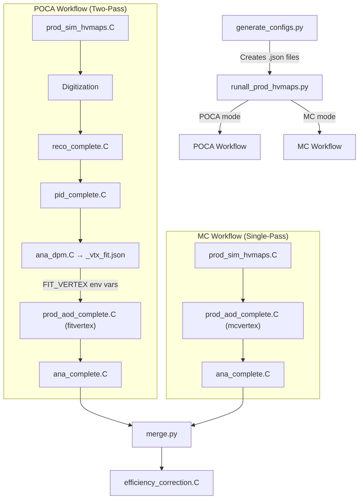

# RestgasDetermination

A PandaRoot-based simulation and analysis framework for determining the **rest gas density profile** along the beam pipe of the PANDA experiment at FAIR. This project extends the [PandaRoot](https://github.com/JinxinLee/PandaRoot.git) framework (tag `oct19`) with a complete workflow for simulating antiproton–rest-gas interactions, reconstructing the primary vertex, and extracting the longitudinal target density profile with efficiency correction.

> **Reference**: The theoretical foundations and methodology are detailed in Chapters 7 and 8 of [thesis.pdf](thesis.pdf).

---

## Table of Contents

- [Physics Motivation](#physics-motivation)
- [Theoretical Overview](#theoretical-overview)
  - [Rest Gas in the PANDA Beam Pipe](#rest-gas-in-the-panda-beam-pipe)
  - [Determination Methodology](#determination-methodology)
  - [Efficiency Correction](#efficiency-correction)
  - [Iterative Reweighting (Advanced)](#iterative-reweighting-advanced)
- [Architecture & Workflow](#architecture--workflow)
  - [Two-Pass POCA Workflow](#two-pass-poca-workflow)
  - [Single-Pass MC Workflow](#single-pass-mc-workflow)
  - [Workflow Diagram](#workflow-diagram)
- [Code Structure](#code-structure)
  - [Core Workflow Scripts (`macro/target/`)](#core-workflow-scripts-macrotarget)
  - [Key PandaRoot Modifications](#key-pandaroot-modifications)
  - [Cluster Execution Scripts](#cluster-execution-scripts)
  - [Deprecated / Auxiliary Scripts](#deprecated--auxiliary-scripts)
- [Prerequisites](#prerequisites)
- [Building](#building)
- [Usage](#usage)
  - [1. Generate Configuration Files](#1-generate-configuration-files)
  - [2. Run the Workflow Locally](#2-run-the-workflow-locally)
  - [3. Run on a SLURM Cluster](#3-run-on-a-slurm-cluster)
  - [4. Merge Parallel Job Outputs](#4-merge-parallel-job-outputs)
  - [5. Apply Efficiency Correction](#5-apply-efficiency-correction)
- [Configuration Reference](#configuration-reference)
- [Output Structure](#output-structure)
- [Rest Gas Density Profile Files](#rest-gas-density-profile-files)
- [License](#license)

---

## Physics Motivation

The **PANDA** (anti-**P**roton **AN**nihilation at **DA**rmstadt) experiment at FAIR uses a cooled antiproton beam colliding with a fixed hydrogen target. However, **residual gas molecules** (H₂, N₂, etc.) remain in the beam pipe despite ultra-high vacuum conditions. Antiproton interactions with this rest gas produce background events whose interaction vertices are distributed along the beam axis according to the rest gas density profile.

Determining this density profile is crucial because:

1. **Background characterisation**: Rest gas interactions constitute an irreducible background to physics channels. Knowing their spatial distribution allows effective subtraction.
2. **Luminosity determination**: The rest gas interaction rate depends on the integrated density, enabling an independent luminosity measurement complementary to the primary target.
3. **Beam pipe vacuum quality**: The reconstructed profile maps the vacuum conditions along the beam pipe, including the effect of cryopumps and other pumping sections.

---

## Theoretical Overview

### Rest Gas in the PANDA Beam Pipe

Residual gas in the beam pipe has a **non-uniform density profile** along the beam axis ($z$-direction). The density $\rho(z)$ is determined by the balance between:
- **Outgassing** from beam pipe walls and detector materials
- **Pumping** by various vacuum pump stations (especially cryopumps)
- **Beam-induced desorption**

The profile is typically described by a text file (e.g., `input/restgas_16012024_with_cryopump.txt`) that provides a tabulated $\rho(z)$ read by the `PndTargetGenerator`.

### Determination Methodology

The rest gas density profile is determined through the following principle:

$$N_{\text{reconstructed}}(z) = \rho(z) \cdot \sigma_{\bar{p}p} \cdot L \cdot \varepsilon(z)$$

where:
- $N_{\text{reconstructed}}(z)$ is the number of reconstructed interactions at position $z$
- $\rho(z)$ is the rest gas density to be determined
- $\sigma_{\bar{p}p}$ is the antiproton-proton interaction cross-section
- $L$ is the integrated luminosity
- $\varepsilon(z)$ is the position-dependent reconstruction efficiency

To extract $\rho(z)$, we invert this relation:

$$\rho(z) \propto \frac{N_{\text{reconstructed}}(z)}{\varepsilon(z)}$$

The efficiency $\varepsilon(z)$ is determined from Monte Carlo simulation, and the corrected distribution $N_{\text{corrected}}(z) = N_{\text{reconstructed}}(z) / \varepsilon(z)$ recovers the true rest gas profile.

### Efficiency Correction

The efficiency correction is a critical step implemented in [`correction/efficiency_correction.C`](macro/target/correction/efficiency_correction.C). It proceeds as follows:

1. **MC Generated distribution** ($h_{\text{gen}}$): The true vertex-$z$ distribution of all generated primary protons from the MC simulation file (`pndsim` tree, selecting `MCTrack.fMotherID==-1 && MCTrack.fPdgCode==2212`).
2. **MC Reconstructed distribution** ($h_{\text{rec}}$): The vertex-$z$ of successfully reconstructed proton–antiproton pairs from the MC analysis output, using either:
   - **Truth variable** (`pvz_mc`): Uses the MC-truth $z$-position of reconstructed tracks $\rightarrow$ gives the "true" efficiency
   - **Reco variable** (`pvz`): Uses the reconstructed $z$-position $\rightarrow$ automatically incorporates resolution smearing and bias
3. **Efficiency** is computed bin-by-bin with Bayesian errors:

$$\varepsilon(z_i) = \frac{h_{\text{rec}}(z_i)}{h_{\text{gen}}(z_i)}$$

4. **Corrected data** (the rest gas profile estimate):

$$N_{\text{corrected}}(z_i) = \frac{N_{\text{data}}(z_i)}{\varepsilon(z_i)}$$

The script implements multiple correction strategies:
- **Truth-Eff correction**: $N_{\text{data}} / \varepsilon_{\text{truth}}$ — uses the MC truth positions for efficiency
- **Reco-Eff correction**: $N_{\text{data}} / \varepsilon_{\text{reco}}$ — uses reconstructed positions, automatically absorbing resolution and bias effects
- **Hybrid correction**: Uses Truth-Eff in the central region ($|z| < 1.5\text{ cm}$) and Reco-Eff in the tails

The quality of the correction is validated by comparing the corrected distribution to the known input (truth) profile and computing the relative deviation.

#### Iterative Reweighting (Advanced)

An advanced iterative efficiency correction is implemented in [`correction/efficiency_correction_steps.C`](macro/target/correction/efficiency_correction_steps.C) to account for the fact that the MC acceptance sample may have a different $z$-distribution than the data:

1. **Iteration 0**: Compute initial efficiency from unweighted MC and apply hybrid correction $\rightarrow \text{Result}_0$
2. **Iteration 1**: Compute per-bin weights $w(z) = \text{Result}_0(z) / h_{\text{gen}}(z)$, reweight MC gen/rec histograms, compute new efficiency, apply correction $\rightarrow \text{Result}_1$

This converges rapidly (typically 1–2 iterations) because the efficiency varies slowly with $z$.

---

## Architecture & Workflow

The primary vertex of a rest gas interaction is **unknown a priori** (unlike the fixed PANDA pellet target). This necessitates a **two-pass** approach:

### Two-Pass POCA Workflow

> Controlled by `"back_prop_vertex": "poca"` in the configuration.

```text
┌─────────────────────── PASS 1: Vertex Finding ──────────────────────┐
│                                                                      │
│  prod_sim_hvmaps.C → digi → reco_complete.C → pid_complete.C        │
│                                                       │              │
│                                                 ana_dpm.C            │
│                                                       │              │
│                                              _vtx_fit.json           │
│                                          (fitted vertex X,Y,Z)       │
└──────────────────────────────────────────────────────────────────────┘
                                    │
                    FIT_VERTEX_X/Y/Z env vars
                                    │
                                    ▼
┌─────────────────────── PASS 2: Refined Analysis ────────────────────┐
│                                                                      │
│  prod_aod_complete.C (suffix="fitvertex")                            │
│    → Digi + Reco + PID (back-propagation to fitted vertex)           │
│                          │                                           │
│                    ana_complete.C                                     │
│                          │                                           │
│               Final NTuples + Validation Plots                       │
└──────────────────────────────────────────────────────────────────────┘
```

**Pass 1** details:
1. **Simulation** (`prod_sim_hvmaps.C`): Generates $\bar{p}p$ events using the DPM (Dual Parton Model) generator with a rest gas target profile (`TargetMode=8`). The interaction vertices are sampled from the density profile file.
2. **Digitization**: Converts MC hits into realistic detector responses.
3. **Reconstruction** (`reco_complete.C`): Performs pattern recognition (STT track finding via `PndTrkTracking2` + `PndApolloniusTripletTrackFinderTask`) and Kalman filtering (`PndRecoKalmanTask2`).
4. **PID** (`pid_complete.C`): Runs the PID correlator (`PndPidCorrelator`) **without** back-propagation (since the vertex is unknown).
5. **Vertex Fitting** (`ana_dpm.C`):
   - Identifies proton and antiproton candidates using PID
   - Calculates the **POCA vertex** for all proton+antiproton track combinations using `RhoVtxPoca::GetPocaVtx()`. The algorithm:
     - For each pair of tracks, models them as helices in the magnetic field with radius $\rho = p_\perp / (0.003 \cdot B_z)$
     - Projects helices to the x-y plane and finds circle intersections
     - Propagates to $z$ via $z_{\text{new}} = z_0 + \rho \cdot \alpha / p_\perp \cdot p_z$
     - For multiple tracks, computes a DOCA-weighted average vertex: $\mathbf{V} = \sum_i (\mathbf{V}_i / \text{DOCA}_i) \;/\; \sum_i (1 / \text{DOCA}_i)$
   - Performs kinematic vertex fitting (`RhoKinVtxFitter`) and 4-momentum constrained fitting (`RhoKinFitter`)
   - Selects the best proton-antiproton pair via minimum $|\Delta E| = |p_{\bar{p}p} - p_{\text{beam}}|$
   - Histograms the fitted vertex X, Y, Z distributions
   - Applies an iterative Gaussian fit (two passes: first a plain Gaussian within $\pm 2\sigma$, then Gaussian + pol1 background within $\pm 1\sigma$)
   - Exports the fitted vertex mean coordinates to a JSON file (`_vtx_fit.json`)

**Pass 2** details:
1. The orchestrator reads the JSON vertex file and exports `FIT_VERTEX_X`, `FIT_VERTEX_Y`, `FIT_VERTEX_Z` as environment variables.
2. `prod_aod_complete.C` is called with the `"fitvertex"` suffix. This triggers `PndPidCorrelator::SetUseFittedVertex(kTRUE)`, causing the track back-propagation in `PndPidTrackInfo::GetTrackInfo()` to propagate tracks to the fitted vertex axis rather than the default (0,0,0).
3. The final analysis (`ana_complete.C`) runs with the improved track parameters, producing validation histograms and vertex statistics.

### Single-Pass MC Workflow

> Controlled by `"back_prop_vertex": "mc"` in the configuration.

A simplified workflow that uses the **MC truth vertex** for back-propagation. Useful for performance studies where the vertex finding step is not the subject of investigation.

1. **Simulation** (`prod_sim_hvmaps.C`)
2. `prod_aod_complete.C` with `"mcvertex"` suffix $\rightarrow$ `PndPidCorrelator::SetUseMcTruthForTarget(kTRUE)`
3. **Analysis** (`ana_complete.C`)

### Workflow Diagram



---

## Code Structure

### Core Workflow Scripts (`macro/target/`)

| File | Role | Description |
| --- | --- | --- |
| [`runall_prod_hvmaps.py`](macro/target/runall_prod_hvmaps.py) | **Orchestrator** | Main entry point. Reads JSON configs, dispatches the POCA or MC workflow, manages parallel execution. |
| [`prod_sim_hvmaps.C`](macro/target/prod_sim_hvmaps.C) | **Simulation** | Geant4 MC simulation. Configures the PANDA detector geometry (including HVMAPS MVD), event generators (DPM/FTF/BOX), and rest gas target profile (`TargetMode=8`). |
| [`reco_complete.C`](macro/target/reco_complete.C) | **Reconstruction** | Track finding (STT Hough + Apollonius triplet) and Kalman fitting. Produces reconstructed tracks (`FinalGenTrack`). |
| [`pid_complete.C`](macro/target/pid_complete.C) | **PID (Pass 1)** | Runs `PndPidCorrelator` with back-propagation disabled. Initial particle identification used for vertex finding. |
| [`ana_dpm.C`](macro/target/ana_dpm.C) | **Vertex Finding** | Calculates POCA vertex from p/p̄ track pairs, performs iterative Gaussian fits, exports fitted vertex to JSON. The core of Pass 1 analysis. |
| [`prod_aod_complete.C`](macro/target/prod_aod_complete.C) | **AOD Production (Pass 2)** | Combined digi+reco+PID with vertex-aware back-propagation. Accepts `"fitvertex"` or `"mcvertex"` suffix to control the propagation target. |
| [`ana_complete.C`](macro/target/ana_complete.C) | **Final Analysis** | Produces final NTuples with POCA vertex, kinematic vertex fit, and 4C fit results. Generates validation plots and vertex statistics. |
| [`generate_configs.py`](macro/target/generate_configs.py) | **Config Generator** | Creates a Cartesian product of parameter combinations (momenta, IP positions, etc.) as JSON config files. |
| [`shared_utils.py`](macro/target/shared_utils.py) | **Utilities** | Shared Python helper functions (command execution, config loading, log parsing). |
| [`merge.py`](macro/target/merge.py) | **File Merger** | Merges ROOT output files from parallel jobs using `hadd`. |
| [`correction/efficiency_correction_2.C`](macro/target/correction/efficiency_correction_2.C) | **Efficiency Correction** | Enhanced efficiency & rest gas profile correction macro supporting custom binning and range strings. |

### Key PandaRoot Modifications

These modifications to the PandaRoot framework (all commits after `ef9a564`) enable the rest gas determination functionality:

#### 1. Track Back-Propagation to Fitted Vertex
**File**: [`pid/PidCorr/PndPidTrackInfo.cxx`](pid/PidCorr/PndPidTrackInfo.cxx)

The `GetTrackInfo()` method was extended with a three-tier propagation target selection:
1. **Fitted Vertex** (`fUseFittedVertex=true`): Reads `FIT_VERTEX_X/Y/Z` environment variables and propagates tracks to the axis through that point.
2. **MC Truth Vertex** (`fUseMcTruthForTarget=true`): Reads the MC truth start vertex of the associated MCTrack.
3. **Default**: Falls back to (0, 0, 0).

This is the most critical modification — it closes the loop between the vertex finding (Pass 1) and the refined reconstruction (Pass 2).

#### 2. PID Correlator Vertex Mode Flags
**File**: [`pid/PidCorr/PndPidCorrelator.h`](pid/PidCorr/PndPidCorrelator.h)

Added `fUseFittedVertex` and `fUseMcTruthForTarget` boolean flags with setters:
```cpp
void SetUseFittedVertex(Bool_t val=kTRUE);
void SetUseMcTruthForTarget(Bool_t val=kTRUE);
```

#### 3. Option String Handling in Master PID Task
**File**: [`tools/MasterTasks/PndMasterMultiPidTask.cxx`](tools/MasterTasks/PndMasterMultiPidTask.cxx)

Routes the `"fitvertex"` and `"mcvertex"` option strings to the appropriate correlator flags:
```cpp
if (fOptions.Contains("fitvertex")) {
    correlator->SetUseFittedVertex(kTRUE);
    correlator->SetUseMcTruthForTarget(kFALSE);
}
if (fOptions.Contains("mcvertex")) {
    correlator->SetUseFittedVertex(kFALSE);
    correlator->SetUseMcTruthForTarget(kTRUE);
}
```

#### 4. Rest Gas Target Mode (TargetMode=8)
**File**: [`tools/MasterTasks/PndMasterRunSim.cxx`](tools/MasterTasks/PndMasterRunSim.cxx)

Added `case 8` to the target mode switch, which configures a pencil beam with a rest gas density profile read from `input/restgas_16012024_with_cryopump.txt`:
```cpp
case 8: {
    tgtfile += "/input/restgas_16012024_with_cryopump.txt";
    aGen->SetDensityProfile(tgtfile);
    aGen->SetBeamRadius(0.1);  // 1mm beam spot sigma
    aGen->ReadDensityFile();
}
```

#### 5. DPM Generator Theta Minimum Adjustment
**File**: [`pgenerators/Direct/PndDpmDirect.cxx`](pgenerators/Direct/PndDpmDirect.cxx)

Added a logarithmic scaling formula to compute a momentum-dependent minimum theta angle for the DPM generator, preventing generation of particles at unphysically small forward angles for given beam momenta:
```cpp
Double_t logangle = TMath::Log(0.4) + (TMath::Log(15.) - TMath::Log(Mom))
                    * (TMath::Log(4) - TMath::Log(0.4)) / (TMath::Log(15) - TMath::Log(1.5));
Double_t CalThtMin = TMath::Exp(logangle);
if (CalThtMin > ThtMin) ThtMin = CalThtMin;
```

#### 6. Kalman Fit NaN Guard
**File**: [`tracking/GenfitTools/recotasks2/PndRecoKalmanFit2.cxx`](tracking/GenfitTools/recotasks2/PndRecoKalmanFit2.cxx)

Added a check for NaN values in track parameters before attempting the Kalman fit, preventing crashes when processing tracks from rest gas interactions at extreme positions:
```cpp
if (std::isnan(tBefore->GetParamFirst().GetPz()) || std::isnan(tBefore->GetParamFirst().GetZ())) {
    tAfter->SetFlag(-11);  // flag -11: NaN in parameters
    return tAfter;
}
```

### Cluster Execution Scripts

| File | Description |
| --- | --- |
| [`submit.sh`](macro/target/submit.sh) | Primary SLURM `sbatch` job array submission script. |
| [`merge.py`](macro/target/merge.py) | Merges ROOT output files from parallel array tasks using `hadd`. |

### Deprecated / Auxiliary Scripts

| File | Status |
| --- | --- |
| `digi_complete.C` | Standalone digitization — superseded by `prod_aod_complete.C` in the automated workflow |
| `pid_new.C` | Experimental PID variant — not used in the main workflow |
| `prod_aod_hvmaps.C` | Earlier AOD production script — replaced by `prod_aod_complete.C` |
| `prod_pid.C` | Standalone PID production — not used |
| `runall_sbatch.py.bak` | Backup of an earlier cluster script |
| `runall_test.py` | Test/debugging version of the orchestrator |
| `run_workflow.py` | Earlier workflow runner — superseded by `runall_prod_hvmaps.py` |
| `houghPlusApolloniusTripletTrackFinder.C` | Custom tracking macro for testing |
| `standardPlusApolloniusTripletTrackFinder.C` | Custom tracking macro for testing |
| `ConvertTrackToRhoCandList.C` | Utility for track conversion — used in development |

---

## Prerequisites

- **PandaRoot** (oct19 tag) compiled with all dependencies (FairRoot, Geant4, ROOT 6.x, etc.)
- **Python 3.6+** (for the orchestrator scripts)
- **ROOT** accessible from the command line (`root` command in PATH)
- Access to the rest gas density profile files in `input/`

---

## Building

This project is built as part of the PandaRoot framework:

```bash
# Clone the repository
git clone https://github.com/JinxinLee/RestgasDetermination.git
cd RestgasDetermination

# Standard PandaRoot build procedure
mkdir build && cd build
cmake .. -DCMAKE_INSTALL_PREFIX=<install_path>
make -j$(nproc)
source config.sh  # Set up environment variables (VMCWORKDIR, etc.)
```

---

## Usage

All workflow scripts are located in `macro/target/`. The working directory should be set to this path, or an absolute path to the scripts should be used.

### 1. Generate Configuration Files

Use `generate_configs.py` to create JSON configuration files for parameter scans:

```bash
# Generate configs for two beam momenta and three IP Z-positions
python3 macro/target/generate_configs.py \
    --type point \
    --vertex poca \
    --moms 8.9 4.06 \
    --ipzs -10.0 0.0 10.0 \
    --nevts 10000 \
    --output-dir configs/my_scan
```

This creates files like `configs/my_scan/point_poca_8.9_0.0_0.0_-10.0.json`.

### 2. Run the Workflow Locally

```bash
cd macro/target

# Run with a single configuration file
python3 runall_prod_hvmaps.py configs/point_poca_8.9_0.0_0.0_0.0.json

# Run all configs in a directory
python3 runall_prod_hvmaps.py configs/my_scan/

# Run in parallel with 4 cores
python3 runall_prod_hvmaps.py configs/my_scan/ -j 4

# Override parameters via command line
python3 runall_prod_hvmaps.py configs/my_scan/ --nevts 5000 --back_prop_vertex mc
```

### 3. Run on a SLURM Cluster

For large-scale production, submit array jobs using `submit.sh`:

```bash
sbatch submit.sh
```

Example `submit.sh`:
```bash
#!/bin/bash
#SBATCH --job-name=pnd_sim
#SBATCH --partition=long
#SBATCH --time=20:00:00
#SBATCH --output=/lustre/panda/jili/oct19/macro/target/data/slurmlog/pnd_sim_%A_%a.log
#SBATCH --error=/lustre/panda/jili/oct19/macro/target/data/slurmlog/pnd_sim_%A_%a.err
#SBATCH --nodes=1
#SBATCH --ntasks=1
#SBATCH --cpus-per-task=1
#SBATCH --mem=24G
#SBATCH --array=1-500
#SBATCH --singularity-container=/cvmfs/vae.gsi.de/vae23/containers/user_container-develop.sif

# Setup PandaRoot environment
source /lustre/panda/jili/oct19/build/config.sh -p

cd /lustre/panda/jili/oct19/macro/target
python3 -u runall_prod_hvmaps.py acc_p20.json
```

Each array task receives a unique `SLURM_ARRAY_TASK_ID` which `runall_prod_hvmaps.py` automatically uses to format output filenames.

### 4. Merge Parallel Job Outputs

After all SLURM jobs complete, merge the ROOT files:

```bash
python3 macro/target/merge.py /path/to/output/prefix/reco/
```

### 5. Apply Efficiency Correction (`efficiency_correction_2.C`)

With both "data" (rest gas simulation) and "acceptance MC" (full-gas/uniform simulation) outputs merged, run `efficiency_correction_2.C`:

```bash
cd macro/target/correction

# Basic usage with wildcard patterns:
root -b -q -l 'efficiency_correction_2.C( \
    "../data/restgas/reco/restgas_*_ana_final.root", \
    "../data/uniform_mc/reco/uniform_*_ana_final.root", \
    "../data/uniform_mc/reco/uniform_*_sim.root", \
    "../data/restgas/reco/restgas_*_sim.root", \
    "restgas_profile_corrected" \
)'

# Usage with explicit file range strings (e.g., files 1 to 100):
root -b -q -l 'efficiency_correction_2.C( \
    "../data/restgas/reco/restgas_%d_ana_final.root,1,100", \
    "../data/uniform_mc/reco/uniform_%d_ana_final.root,1,500", \
    "../data/uniform_mc/reco/uniform_%d_sim.root,1,500", \
    "../data/restgas/reco/restgas_%d_sim.root,1,100", \
    "restgas_profile_corrected" \
)'
```

This produces:
- `restgas_profile_corrected.png` — Diagnostic plots
- `restgas_profile_corrected.root` — Saved ROOT histograms and profiles

---

## Configuration Reference

All parameters can be set in JSON config files, overridden by command-line arguments:

| Parameter | Type | Default | Description |
| --- | --- | --- | --- |
| `prefix` | string | `"test"` | Name for the job; creates a subdirectory under `output_path` |
| `nevts` | int | `1000` | Number of events to simulate per job |
| `dec` | string | `"pp_dd"` | Generator type: `DPM`, `DPM1`, `DPM2`, `FTF`, `FTF1`, `BOX`, or EvtGen decay file |
| `mom` | float | `4.06` | Antiproton beam momentum in GeV/c |
| `use_mvd_hvmaps` | string | `"false"` | `"true"` to use HVMAPS MVD geometry (`all_hvmaps.par`) |
| `ipx`, `ipy`, `ipz` | float | `0.0` | Interaction point coordinates (cm) |
| `use_restgas` | string | `"false"` | `"true"` to enable rest gas target profile (`TargetMode=8`) |
| `theta_min` | float | `0.0` | Minimum theta angle for DPM generator (degrees) |
| `theta_max` | float | `180.0` | Maximum theta angle for DPM generator (degrees) |
| `back_prop_vertex` | string | `"poca"` | Workflow mode: `"poca"` (two-pass) or `"mc"` (single-pass with MC truth) |
| `output_path` | string | `"data"` | Base path for all output files |

Example JSON config:
```json
{
    "prefix": "restgas_8.9GeV_z0",
    "nevts": 10000,
    "dec": "DPM",
    "mom": 8.9,
    "use_mvd_hvmaps": "true",
    "ipx": 0.0,
    "ipy": 0.0,
    "ipz": 0.0,
    "use_restgas": "true",
    "theta_min": 0.5,
    "theta_max": 140.0,
    "back_prop_vertex": "poca",
    "output_path": "/lustre/panda/user/restgas_output"
}
```

---

## Output Structure

```text
<output_path>/
└── <prefix>/
    ├── config.json                          # Saved configuration for this run
    ├── log/
    │   ├── <prefix>_<job_id>_sim.log        # Simulation log
    │   ├── <prefix>_<job_id>_digi.log       # Digitization log
    │   ├── <prefix>_<job_id>_reco.log       # Reconstruction log
    │   ├── <prefix>_<job_id>_pid.log        # PID log (Pass 1)
    │   ├── <prefix>_<job_id>_ana.log        # Vertex fitting log
    │   ├── <prefix>_<job_id>_aod_complete.log  # AOD production log (Pass 2)
    │   └── <prefix>_<job_id>_ana_complete.log  # Final analysis log
    ├── reco/
    │   ├── <prefix>_<job_id>_sim.root       # MC simulation output
    │   ├── <prefix>_<job_id>_digi.root      # Digitized hits
    │   ├── <prefix>_<job_id>_reco.root      # Reconstructed tracks
    │   ├── <prefix>_<job_id>_pid.root       # PID output (Pass 1)
    │   ├── <prefix>_<job_id>_boost.root     # Vertex fitting NTuples (ana_dpm)
    │   ├── <prefix>_<job_id>_vtx_fit.json   # Fitted vertex coordinates
    │   ├── <prefix>_<job_id>_pid_poca.root  # PID output (Pass 2, vertex-aware)
    │   └── <prefix>_<job_id>_ana_final.root # Final analysis NTuples
    └── figure/
        ├── <prefix>_<job_id>_vtx_fit.png    # Vertex fit plots (X, Y, Z)
        └── <prefix>_<job_id>_vtx_verification.png  # Validation plots
```

---

## Rest Gas Density Profile Files

Two rest gas density profiles are included in `input/`:

| File | Description |
| --- | --- |
| `restgas_16012024_with_cryopump.txt` | Profile with cryopump effect (default, used by `TargetMode=8`) |
| `restgas_16012024_no_cryopump.txt` | Profile without cryopump |

These text files cover the range **$z = -570\text{ cm}$ to $+1100\text{ cm}$** (the full beamline extent), with densities given in units of $10^{12}\text{ atoms/cm}^2$. The profiles show a flat background level ($\sim 0.03 \times 10^{12}\text{ atoms/cm}^2$) far from the target with higher density features near pumping stations. They are read by `PndTargetGenerator::ReadDensityFile()` and provide the $z$-dependent density used to sample interaction vertices during simulation.

---

## License

This project is distributed under the **GNU General Public License (GPL) version 3**, as part of the PandaRoot framework. See [COPYING](COPYING) for details.